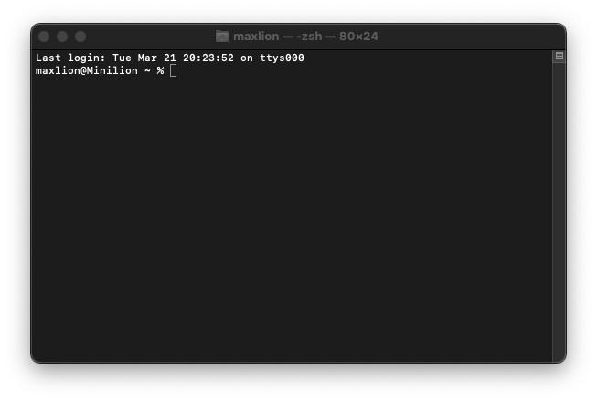
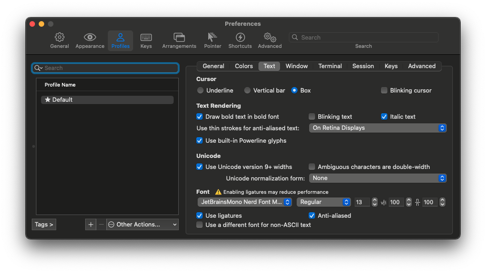

# Симпатичный Mac с нуля

После приобретения Mac Mini и двух дней попыток установить на машинку 2012 года MacOS Ventura через OpenCore Patcher встал вопрос о настройке новой системы. Заодно решил описать этот процесс и использовать для себя как шпаргалку. Есть задумка автоматизировать большую часть процесса и этот документ так же может быть использован как основа.

Disclaimer. Этот материал описывает мой текущий опыт. Возможно, некоторые шаги кому-то покажутся неоптимальными и это можно сделать проще или удобнее. Возможно, через некоторое время мне и самому так покажется. 


В чистой macOS последних версий по умолчанию используется zsh, но вид у него весьма дефолтный и грустный. Одна из целей работы — придать командной строке более приятный и информативный вид.

## Homebrew

Пакетные менеджеры — это круто и практично. Для MacOS (и Linux) есть [Homebrew](https://brew.sh/index_ru). Он очень функциональный и удобный. Часть документации переведена на русский. Мы остановимся вкратце на установке и основном функционале.

### Установка

В MacOS он устанавливается скриптом:
```
/bin/bash -c "$(curl -fsSL https://raw.githubusercontent.com/Homebrew/install/HEAD/install.sh)"
```

### Поиск пакетов

Искать пакеты можно командой ***search***, причем работает "fuzzy search". То есть, homebrew предлагает похожие по названию или описанию пакеты, если не находит прямого соответствия.

Поищем, что есть яндексового:
```
maxlion@Minilion ~ % brew search yandex 
==> **Casks**
yandex                                   yandex-disk
yandex-cloud-cli                         yandex-music-unofficial
```

В homebrew есть cask'и и formulae. Если очень приблизительно: 
- cask — это те же приложения, которые можно скачать с их официальных сайтов, с GUI и обычно проприетарные. Это .app-пакеты, они появляются в главном меню. Через homebrew можно установить Firefox, Яндекс Браузер, Postman, Telegram и т. д. Они скачиваются с официальных сайтов продуктов, как если бы мы делали это вручную со страницы загрузок, но плюс в том, что их можно установить и обновить в одну строку
- formulae — это, как правило, консольные опенсорсные программы, шрифты, библиотеки и т. д.

### Просмотр информации о конкретном пакете

В описании пакета можно удостовериться в его составе и получить ссылки на репозиторий продукта или увидеть, какие и в каких директориях файлы создаются при установке.

```
maxlion@Minilion ~ % brew info yandex
==> **yandex**: 23.1.2 (auto_updates)
https://browser.yandex.ru/
Not installed
From: https://github.com/Homebrew/homebrew-cask/blob/HEAD/Casks/yandex.rb
==> **Name**
Yandex.Browser
==> **Description**
Web browser
==> **Artifacts**
Yandex.app (App)
==> **Analytics**
install: 6 (30 days), 183 (90 days), 832 (365 days)
```

>  Яндекс Браузер установился версии 22.7.5.1018, хотя в инфо отмечена более свежая версия. Странно, надо будет потом разобраться, что не так. Может, пути на скачивание поменялись или что-то в этом роде.

```
maxlion@Minilion ~ % brew info yandex-cloud-cli
==> **yandex-cloud-cli**: latest
https://cloud.yandex.com/docs/cli/
Not installed
From: https://github.com/Homebrew/homebrew-cask/blob/HEAD/Casks/yandex-cloud-cli.rb
==> **Name**
Yandex Cloud CLI
==> **Description**
None
==> **Artifacts**
install.sh (Installer)
yandex-cloud-cli/bin/yc (Installer)
yandex-cloud-cli/bin/docker-credential-yc (Binary)
yandex-cloud-cli/bin/yc (Binary)
==> **Caveats**
To install shell completions add this to your profile:
  for bash users
    source "/usr/local/Caskroom/yandex-cloud-cli/latest/yandex-cloud-cli/completion.bash.inc"
  for zsh users
    source "/usr/local/Caskroom/yandex-cloud-cli/latest/yandex-cloud-cli/completion.zsh.inc"
==> **Analytics**
install: 0 (30 days), 53 (90 days), 305 (365 days)
```

Еще можно посмотреть статистику по установкам, в разделе Artifacts указано, какие файлы входят в состав пакета, а в разделе Caveats есть информация о запуске служб или о дополнительных необходимых настройках.  Например, для YC CLI есть инструкция о том, как включить автодополнение команд для bash и zsh.

Да, homebrew может запускать "демонов" почти как systemd в Linux. Это может быть полезно, например, при установке клиента оверлейной IPv6-сети Yggdrasil — адреса из этой сети будут разрешаться автоматически с каждым запуском системы, если включить автозагрузку.

## Установка и настройка софта на первое время

Приступим к установке и настройке инструментов и софта. Предпочтения и потребности у всех разные, поэтому список софта нужно подстроить под себя.

Я пользуюсь эмулятором терминала iTerm 2, потому что по умолчанию в MacOS терминал фанерный. В целом, не так уж важно, какой эмулятор терминала будет.

```
maxlion@Minilion ~ % brew install neovim \
firefox \
yandex \
yandex-disk \
yandex-cloud-cli \
awscli \
ranger \
mc \
iterm2 \
telegram \
obsidian \
keepassxc \
syncthing \
qemu \
exa
```

#### Приличный шрифт для терминала

Впервые запустив iTerm 2 в окне терминала можно увидеть шрифт, который лично мне напоминает Comic Sans. Меня с таким шрифтом работать не устраивает и так как Homebrew уже установлен — логично посмотреть, какие шрифты предлагает он. 

Но для того, чтобы увидеть шрифты, надо добавить дополнительный репозиторий:
```
brew tap homebrew/cask-fonts
```

Тогда для поиска становятся доступны в том числе [nerd-шрифты от Ryanoasis](https://github.com/ryanoasis/nerd-fonts). Мне нравится JetBrains Mono Nerd — его и установим:
```
brew install font-jetbrains-mono-nerd-font
```

Когда поменяем тему для zsh — нам пригодится unicode-шрифт с дополнительными лигатурами.

#### Настройка шрифта в терминале

iTerm 2 предлагает широкие возможности профилирования терминала под разные задачи, приложения и т. д. Но сейчас я захожу в Профили просто чтобы поменять шрифт. Для этого достаточно нажать **⌘ + O** > Edit Profiles... > выбрать профиль Default > Text > в разделе Font выбрать "JetBrainsMono Nerd Font Mono" > установить галочку "Use ligatures".

### Мой форк getantidote/zdotdir

zdotdir — навороченный конфиг для zsh от разработчика менеджера zsh-плагинов Antidote.

Благодаря менеджеру плагинов мы просто указываем в текстовом файле список дополнений для zsh, которые хотим установить, а он сам скачивает их с Github, подключает и обновляет их.

Конфиг от getantidote хорош уже из коробки, но мне хочется использовать тему Powerlevel10k от romkatv и еще кое-какие вещи: neovim вместо vim, exa с иконками вместо ls и т. д. А еще нужно в правильном месте прописать плагины автоподсказок для Yandex Cloud CLI (!TODO).

Для всего этого я сделал свой форк проекта — [eximoelle/my-zdotdir](https://github.com/eximoelle/my-zdotdir).

#### Установка eximoelle/my-zdotdir
 
Руководствуйтесь инструкцией по установке в репозитории [eximoelle/my-zdotdir](https://github.com/eximoelle/my-zdotdir).